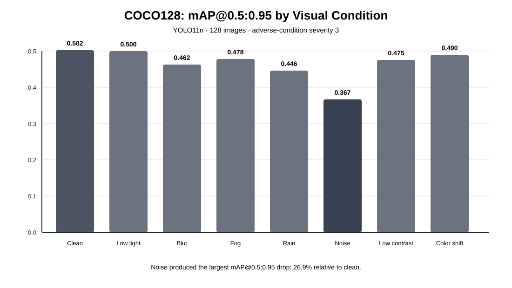

# Domain-Robust Object Detection Under Adverse Visual Conditions

An ongoing computer-vision project for studying how object detectors behave when illumination, blur, weather-like effects, image noise, contrast, or camera appearance changes. The current implementation establishes a reproducible clean-vs-adverse benchmark pipeline; robust training and broader real-world domain evaluation remain future work.

## Project goals

This project explores object-detection robustness when the visual domain changes.

The current work focuses on:

- evaluating a pretrained detector on clean images;
- generating controlled adverse visual conditions without changing bounding-box geometry;
- measuring precision, recall, mAP@0.5, and mAP@0.5:0.95 across conditions;
- quantifying the performance gap between clean and degraded inputs;
- recording class-wise and condition-wise behavior;
- preparing the same evaluation protocol for later augmentation, image-enhancement, and domain-robust training experiments.

## Current project stage

The repository now contains a reusable Python package, experiment tools, configuration, unit tests, continuous integration, and a small reproducibility benchmark based on the Ultralytics COCO8 validation split.

COCO8 is used only as a **smoke benchmark** to verify that the complete clean-to-adverse evaluation pipeline runs correctly. Its four validation images are not large enough to support research-level conclusions. Larger and real adverse-condition datasets are planned for later experiments.

## Pipeline

```text
clean labeled images
        |
        +--------------------------+
        |                          |
        v                          v
 baseline detector          adverse-condition generator
        |                          |
        |                    low light / blur
        |                    fog / rain / noise
        |                    low contrast / color shift
        |                          |
        +------------+-------------+
                     |
                     v
            condition-wise detection
                     |
                     v
       precision / recall / mAP metrics
                     |
                     v
          clean-to-adverse gap analysis
                     |
          +----------+-----------+
          |                      |
          v                      v
   class-wise analysis      failure examples
          |                      |
          +----------+-----------+
                     v
       later robustness strategies
```

## Tools and software used so far

| Tool / software | Current use |
| --- | --- |
| **Python** | Main implementation language |
| **Ultralytics YOLO** | Baseline object detection and validation |
| **OpenCV** | Image loading and adverse-condition transformations |
| **NumPy** | Numerical image operations and deterministic corruptions |
| **Pandas** | Condition-wise metric tables and robustness summaries |
| **PyYAML** | Experiment configuration |
| **Matplotlib** | Metric comparison plots |
| **pytest** | Unit tests for degradation and robustness utilities |
| **Git / GitHub** | Version control, documentation, and experiment tracking |
| **GitHub Actions** | Reproducible unit tests and smoke benchmark execution |
| **COCO8** | Small current smoke benchmark for validating the complete workflow |

### Dataset status

The present stage is **dataset-based**. No robotics simulator is required for this project. Synthetic adverse conditions are first applied to a clean labeled validation set so that the same ground-truth boxes can be reused and the effect of visual degradation can be isolated.

## Adverse conditions implemented

The current implementation supports five severity levels for:

- low illumination;
- Gaussian blur;
- fog-like contrast loss;
- rain-like streaks;
- Gaussian image noise;
- reduced contrast;
- camera/color shift.

All current transformations preserve image dimensions and object geometry.

## Planned datasets and extensions

The next research stage will move beyond the tiny smoke benchmark.

| Dataset / method | Planned use |
| --- | --- |
| **Larger COCO subset** | More stable clean-vs-synthetic corruption measurements |
| **BDD100K or another driving dataset** | Natural variation in illumination, weather, and camera scenes |
| **ExDark or another low-light detection dataset** | Real low-illumination evaluation |
| **Mixed-condition augmentation** | Train with controlled adverse transformations |
| **Gamma correction / CLAHE / denoising** | Test simple preprocessing before detection |
| **Domain-robust training strategies** | Reduce the cross-condition detection gap |
| **Failure-case analysis** | Organize misses, false positives, confidence drops, and localization errors |

Candidate external datasets will be selected according to task fit, annotation compatibility, and licensing before larger experiments are reported.

## Repository layout

```text
.github/workflows/             CI and reproducible smoke benchmark
configs/                       experiment configuration
data/                          local datasets (large files ignored)
docs/                          milestones and experiment log
results/                       generated outputs (ignored except documentation)
src/domain_robust_detection/   reusable Python package
tests/                         unit tests
tools/                         command-line experiment scripts
```

## Setup

Python 3.10+ is recommended.

```bash
python -m venv .venv
```

Linux/macOS:

```bash
source .venv/bin/activate
```

Windows PowerShell:

```powershell
.venv\Scripts\Activate.ps1
```

Install the project:

```bash
pip install -e .
```

## 1. Run baseline detection

```bash
python tools/run_detection.py \
  --source path/to/images \
  --model yolo11n.pt
```

Predictions are written under `results/baseline/predictions/`.

## 2. Create an adverse image set

```bash
python tools/create_adverse_conditions.py \
  --input path/to/clean/images \
  --output data/adverse/low_light \
  --condition low_light \
  --severity 3
```

## 3. Prepare a labeled adverse validation split

When YOLO-format labels are available:

```bash
python tools/prepare_adverse_dataset.py \
  --images path/to/images/val \
  --labels path/to/labels/val \
  --output data/adverse/blur \
  --condition blur \
  --severity 3
```

The image geometry is preserved, so label files are copied without changing normalized bounding boxes.

## 4. Evaluate one condition

```bash
python tools/evaluate_detector.py \
  --data path/to/data.yaml \
  --condition clean \
  --output results/metrics/condition_metrics.csv
```

## 5. Compare conditions

After clean and adverse evaluations have been written to one CSV:

```bash
python tools/compare_conditions.py \
  --input results/metrics/condition_metrics.csv \
  --output results/metrics/robustness_summary.csv \
  --plot results/metrics/map50_95_by_condition.png
```

The summary reports absolute and relative metric drops against the clean baseline.

## Reproducible smoke benchmark

The repository includes a small end-to-end benchmark configuration:

```bash
python tools/run_smoke_benchmark.py --config configs/coco8_smoke.yaml
```

The command:

1. evaluates a pretrained YOLO model on clean COCO8 validation images;
2. generates each configured adverse condition;
3. evaluates the same model on every transformed validation set;
4. saves a condition-wise metrics CSV;
5. computes clean-to-adverse robustness gaps;
6. renders a mAP@0.5:0.95 comparison plot.

The GitHub Actions workflow runs the same pipeline and uploads the generated experiment outputs as artifacts.

## Metrics

The current protocol records:

- precision;
- recall;
- mAP@0.5;
- mAP@0.5:0.95;
- class-wise AP when available;
- absolute metric drop from clean;
- relative metric drop from clean.

## Current benchmark result

The current primary baseline is a completed **COCO128 robustness experiment** using **YOLO11n**, **128 labeled images**, severity level **3**, and seven controlled adverse visual conditions.

| Condition | Precision | Recall | mAP@0.5 | mAP@0.5:0.95 | Relative mAP@0.5:0.95 drop |
| --- | ---: | ---: | ---: | ---: | ---: |
| Clean | 0.663 | 0.589 | 0.670 | **0.502** | reference |
| Low light | 0.749 | 0.541 | 0.661 | 0.500 | 0.4% |
| Blur | 0.683 | 0.541 | 0.635 | 0.462 | **8.0%** |
| Fog | 0.728 | 0.564 | 0.646 | 0.478 | 4.8% |
| Rain | 0.647 | 0.534 | 0.607 | 0.446 | **11.2%** |
| Noise | 0.540 | 0.459 | 0.501 | **0.367** | **26.9%** |
| Low contrast | 0.674 | 0.580 | 0.639 | 0.475 | 5.4% |
| Color shift | 0.683 | 0.559 | 0.651 | 0.490 | 2.5% |



In this controlled 128-image run, Gaussian image noise produced the largest drop in mAP@0.5:0.95, followed by rain and blur. The experiment was executed successfully in GitHub Actions and its measured outputs are retained permanently in the repository under `docs/results/`.

A detailed experiment note is available in `docs/coco128_baseline.md`.

The earlier **COCO8 four-image run** is retained only as a smoke test for end-to-end reproducibility and should not be treated as the main experimental result.

## Current evidence

At the current stage, the repository demonstrates:

- a reusable adverse-condition generation package;
- deterministic corruption controls and severity levels;
- YOLO clean/adverse validation tools;
- label-preserving adverse dataset preparation;
- condition-wise metric logging;
- clean-to-adverse gap analysis;
- automated metric visualization;
- unit tests;
- continuous integration;
- an end-to-end reproducible smoke-benchmark workflow.

Numerical smoke-test results should be interpreted only as pipeline validation because COCO8 contains very few validation images.

## Future work

Development is intentionally incremental:

1. Extend the completed COCO128 baseline across severity levels 1-5.
2. Add qualitative failure-case examples for clean, blur, rain, and noise.
3. Add mixed-condition training augmentation.
4. Test simple image enhancement before detection.
5. Compare baseline, augmentation, enhancement, and combined strategies.
6. Add one or more real adverse-condition datasets.
7. Expand class-wise and failure-case analysis.
8. Study whether robustness improvements transfer across datasets and camera domains.

See `docs/milestones.md` for the implementation roadmap and the separation between current work and future extensions.
